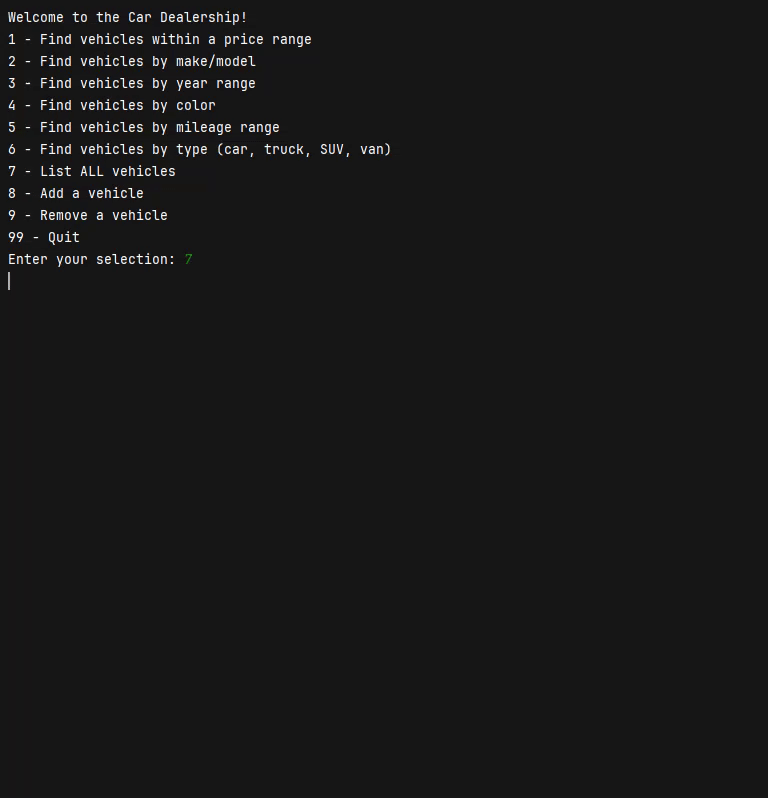

# Car Dealership 

## Project Overview

Car Dealership is a Java-based command-line application that simulates the operations of a car dealership system. 
It allows users to browse and search a dealership’s vehicle inventory by various criteria such as price range, make/model, year, color, mileage, and type. 
Users can view all available vehicles, add new listings, or remove existing ones, with all updates automatically saved to a dealership data file.
## User Stories

- As a user, I want to view all vehicles in the dealership's inventory, so that I can quickly scan available stock.
- As a salesperson, I want to search for vehicles between a minimum and maximum price, so that I can show customers cars that fit their budget.
- As a salesperson, I want to search by vehicle make and/or model, so that I can quickly locate specific brands.
- As a salesperson, I want to filter vehicles between two years, so that I can show customers newer or older models.
- As a salesperson, I want to find all vehicles of a given color, so that I can meet customer style preferences.
- As a salesperson, I want to filter cars by mileage range, so that I can show vehicles with acceptable wear.
- As a salesperson, I want to find vehicles by their type, so that I can focus on what category the customer prefers.
- As a manager, I want to add a new vehicle to the inventory, so that I can expand available listings.
- As a manager, I want to remove a vehicle from inventory, so that I can keep the dealership's inventory accurate.

## Setup

Instructions on how to set up and run the project using IntelliJ IDEA:

### Prerequisites

- IntelliJ IDEA: Ensure you have IntelliJ IDEA installed, which you can download from [here](https://www.jetbrains.com/idea/download/).
- Java SDK: Make sure Java SDK is installed and configured in IntelliJ.

### Running the Application in IntelliJ

Follow these steps to get your application running within IntelliJ IDEA:

1. Open IntelliJ IDEA.
2. Select "Open" and navigate to the directory where you cloned or downloaded the project.
3. After the project opens, wait for IntelliJ to index the files and set up the project.
4. Find the main class with the `public static void main(String[] args)` method.
5. Right-click on the file and select 'Run 'YourMainClassName.main()'' to start the application.

## Technologies Used

- Java: Amazon Corretto 17.0.16

## Demo

## Future Work

- Custom search incorporating various filters.
- Export/import filtered search results.
- Introduce roles (managers can modify and customers can only view).

## Resources

- [Potato Sensei - OpenAI: ChatGpt 5 LLM](https://chatgpt.com/g/g-681d378b0c90819197b16e49abe384ec-potato-sensei)
- [Capstone 1: Financial Tracker Repository](https://github.com/nati-tewolde/financial-tracker)
- [Workshop 2: Online Store](https://github.com/nati-tewolde/online-store)

## Team Members

- **Natnael Tewolde:** Main Contributor

## Thanks

- Once again, thank you to both *potato senseis* for your continuous support and guidance!
